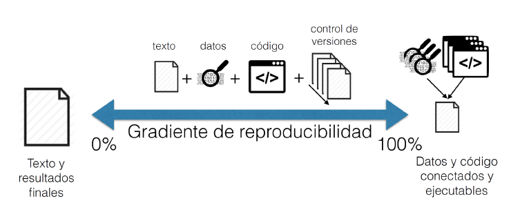

```{r setup, include=FALSE, comment=TRUE}
knitr::opts_chunk$set(echo = FALSE)
```

## 
<div class="centered">
<div class="black">
**PLAN DE CLASE**
</div>
</div>

<div class="black">
**1).** **Introducción**
</div>

- **Preguntas al curso.**

- **¿Qué es R y Rstudio?**

- **¿Por qué usar R para el análisis de datos?**

- **R en investigación reproducible.**

- **¿Qué es un script?**

<div class="black">
**2).** **Práctica con R y Rstudio (cloud)**
</div>

- **Iniciar un proyecto de análisis de datos con R.**

- **Escribir un script.**

- **Familiarizarse con manipulación de objetos y datos.**


## 
<div class="centered">
<div class="black">
**PREGUNTAS AL CURSO**
</div>
</div>

<div class="black">
**1).** **¿Qué problemas has tenido al realizar análisis de datos?**

**2).** **¿ Qué problemas has tenido cuando quieres rehacer un análisis de datos a partir de un set de datos antiguo o en el que no has trabajado por mucho tiempo?**
</div>

## 
<div class="centered">
<div class="black">

**¿QUÉ ES R?**

</div>
</div>

<div class="black">
**1).** **R** es un lenguaje y entorno de programación de código abierto o libre creado por Ross Ihaka y Robert Gentleman en 1993 (University of Auckland) para realizar análisis estadísticos y gráficos.


**2).** Los usuarios de R tienen la libertad de ejecutar, copiar, distribuir, estudiar, modificar y mejorar el **_software_**.

**3).** Utilizar **R** supone un ahorro económico para los estudiantes, las instituciones educativas o incluso las empresas que decidan usarlo.
</div>


## 
<div class="centered">
<div class="black">

**¿POR QUÉ USAR "R"?**

</div>
</div>

<div class="black">

- Aprender a usar **R** te da **_independencia digital_**, te permite **_cooperar con otros_** y **_beneficiarte de la ayuda de otro._**

- Actualmente existen cerca de **17.000 librerías** o aplicaciones disponibles de forma gratuita para trabajar con R en ámbitos tan diferentes como las ciencias sociales, la economía, la astronomía, la ingeniería y la acuicultura.

- **R** permite entonces difundir el conocimiento a toda la sociedad y no solo a los que pueden pagar por ella.
</div>

## 
<div class="centered">
<div class="black">

**BENEFICIOS DE USAR R PARA EL ANALISTA DE DATOS**

</div>
</div>

<div class="black">

- **Permite la ejecución de tareas de análisis repetitivo sin esfuerzo.**
- Muy fácil corregir y regenerar resultados, tablas y figuras.
- **Reducción drástica del riesgo de errores.**
- Facilita la colaboración.
- **Mayor facilidad para escribir reportes.**
- Facilita el proceso de revisión.
- **Ahorro de tiempo y esfuerzo al reutilizar código en otros proyectos.**
</div>

## 
<div class="centered">
<div class="black">

## 

**R EN INVESTIGACIÓN REPRODUCIBLE**

</div>
</div>

<div class="centered">
<div class="black">
Trabajar con R permite realizar **Investigación reproducible**. 
La investigación reproducible implica que desde los mismos datos y códigos se generarán los mismos resultados.

</div>
</div>
<div class="columns-1">
```{r, echo=FALSE, out.width = '100%' }

```
</div>

## 
<div class="centered">
<div class="black">

**ALGUNOS CRITERIOS DE REPRODUCIBILIDAD**

</div>
</div>

<div class="black">
- **Los datos originales están disponibles en la nube.**
- Los datos están almacenados en formato abierto (texto) .
- **Todo el análisis y manejo de datos se hace mediante código.**
- El código genera las tablas y figuras finales.
- **Los datos brutos están separados de los datos derivados.**
- Existe un **_‘script’_** maestro que ejecuta todos los pasos del análisis ordenadamente.
- **Existe un documento README que explica los objetivos y organización del proyecto.**
- Tanto el reporte, como los datos y código son públicos.
</div>

## 

<div class="centered">
<div class="black">

**RUTA DEL ANÁLISIS DE DATOS REPRODUCIBLE CON R**

- Toma de datos.    
Es importante estandarizar y mantener estructura.   
- Manipulación de datos.  
Es importante cuidar los datos originales, trabajaremos con R + Rstudio  
- Análisis datos integrado con texto.  
Facilita la colaboración, trabajaremos R + Rstudio + Markdown
- Publicar resultados.  
Es importante comunicar de forma efectiva

</div>
</div>

## 
<div class="centered">
<div class="black">

**R ES UN LENGUAJE ORIENTADO A OBJETOS**

**Ejemplo del objeto "Bombero"**
</div>
</div>
<div class="columns-2">


<div class="black">
<div class="centered">

* En Chile trabajan *ad honoren*.
* Apagan incendios.
* Pueden usar diferentes equipos.
* Reciben instrucciones sobre como apagar un incendio.
* Pero, no pueden detener a ladrones, ni dirigir el transito (Objeto policía).

</div>
</div>
</div>

##

**R ES UN LENGUAJE ORIENTADO A OBJETOS 2**

**Objeto data.frame**
</div>
</div>
<div class="columns-2">


<div class="black">
<div class="centered">

* Objeto similar a una tabla de datos.
* Almacenan texto o números.
* Primera fila contiene el nombre de las variables.
* Puedo unir con otro **data.frame**.
* Puedo aplicar funciones para calcular estadísticos.
* Pero, no tiene atributos de una matriz, ni de un vector, ni es una serie de tiempo.
</div>
</div>
</div>

##

**TIPOS DE OBJETOS PARA TRABAJAR CON R**

</div>
</div>
```{r, echo=FALSE, out.width = '100%' }
knitr::include_graphics("ObjetosR.png")
```
</div>


## 

<div class="centered">
<div class="black">

**¿QUÉ ES UN SCRIPT?**

</div>
</div>

<div class="black">

Los **_scripts_** son documentos de texto con una secuencia de comandos que permiten ejecutar programas.

Estos archivos son iguales a cualquier documentos de texto, pero **R puede leer y ejecutar** el código que contienen.

Los códigos de **R** están contenidos en librerías o packages.

Algunos **_script_** que usaremos en este curso tienen extensión de archivo **.R**, por ejemplo mi_script.R o **.Rmd** (R+markdown) por ejemplo reporte.Rmd.

</div>

## 

<div class="centered">
<div class="black">

**EJEMPLO DE SCRIPT R**
```{r, echo=FALSE, out.width = '100%' }

```
</div>
</div>

##

**¿QUÉ ES R STUDIO?**

</div>
</div>

<div class="black">

* **Rstudio** es el más popular entorno de desarrollo integrado (integrated development environment, IDE) para trabajar con **R**.

* **Rstudio** es un **_software_** libre y de código abierto creado por **Joseph J. Allaire en 2009** para la ciencia de datos, la investigación científica y la comunicación técnica.

* Actualmente es mantenido por la Corporación de Beneficio Público **Rstudio PCB**, la que ha creado otros software como Rmarkdown.
</div>

## 

<div class="centered">
<div class="black">

**EJEMPLO RSTUDIO - VERSION CLOUD**

```{r, echo=FALSE, out.width = '100%' }
knitr::include_graphics("rstudio.png")
```
</div>
</div>

## 

<div class="centered">
<div class="black">

**Práctica con R y Rstudio**

</div>
</div>

<div class="black">
**1).** **Guía de trabajo programación con R disponible en drive.** Ingresa al siguiente link de la *[clase 2](https://drive.google.com/drive/folders/1SnGKboDxZllKlPap-BXWz7ojcSvC7o8t?usp=sharing)*

**2).** **La tarea se realiza en Rstudio.cloud**. Ingresa al siguiente proyecto de *[Rstudio.Cloud](https://rstudio.cloud/spaces/153136/project/2684759)* 

</div>


## 

<div class="centered">
<div class="black">

**RESUMEN DE LA CLASE**

</div>
</div>

<div class="black">

* Ruta del análisis de datos reproducible con **R**.

* Iniciamos un proyecto de análisis de datos.

* Escribimos un código de programación con **R** y **Rstudio cloud**.

* Nos familiarizamos con la manipulación de objetos.

</div>

